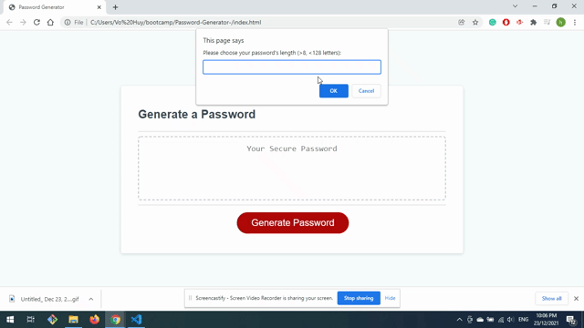
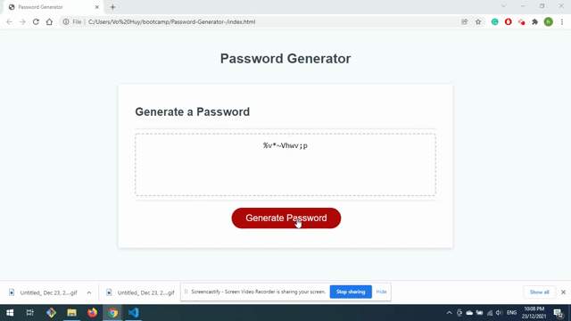

# 03 JavaScript: Password Generator

## Introduction

This application is a Password Generator based on selected criteria. This app will run in the browser and will feature dynamically updated HTML and CSS powered by JavaScript. It will also have a clean and polished, responsive user interface that adapts to multiple screen sizes.

The password can include special characters. If you’re unfamiliar with these, see this [list of password special characters](https://www.owasp.org/index.php/Password_special_characters) from the OWASP Foundation.

## User guidelines

- Click the button to generate a password, a series of prompts for password criteria will appear for user to decide. 
- Enter a length of at least 8 characters and no more than 128 characters
- Choose character types to include in the password (lowercase, uppercase, numeric, and/or special characters) like "!"#$%&'()*+,-./:;<=>?@[\]^_`{|}~"  by answers a series of promts 
- When all the criteria are chosen, the password will be generated and displayed on the page, if no criteria were chosen, a message will appear to ask user to try again.

## Mock-Up

The following image shows the web application's appearance and functionality:

## URLs 

* The URL of the deployed application:https://huyhhv.github.io/Password-Generator-/

* The URL of the GitHub repository: https://github.com/HuyHHV/Password-Generator-

- - -
